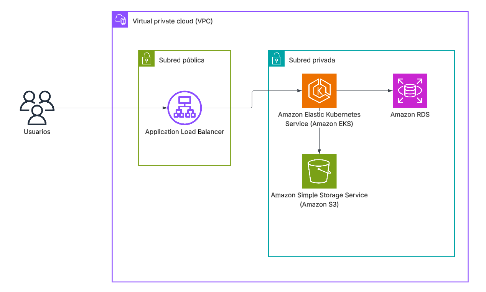

# Scripts para generar infraestructura en la nube de QuickInv
Estos scripts generan la infraestructura necesaria para alojar el sistema de QuickInv en la nube de AWS. El diagrama reducido de la infraestructura es el siguiente:

> [!NOTE]
> Un dato curioso de la infraestructura real generada por el archivo de Terraform es que se tiene que incluir un NAT Gateway porque sino los nodos del clúster de EKS no pueden inicializarse. 

Se le quiere mucho profe :)